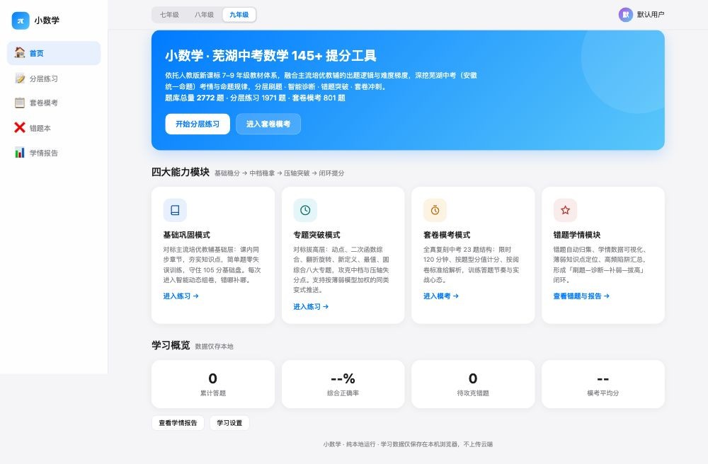
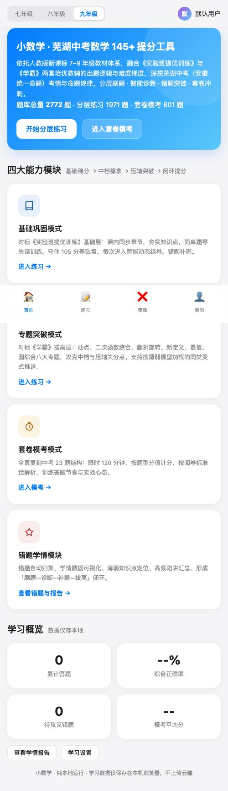

# 小数学 · 芜湖中考数学 145+ 提分工具

> 初中生数学刷题系统 · 纯前端 · 免安装 · 可离线 · iOS 风格界面 · 支持多用户

把「中考数学刷题」做成一个每天拿来用的静态学习工具：
选年级 → 选章节/专题 → 刷题 → 自动判分 → 错题归集 → 学情诊断 → 针对性补弱 → 闭环提分。

题库对标《实验班提优训练》《学霸》两套主流培优教辅出题逻辑，覆盖人教版 7-9 年级全学段。

---

## 界面预览

| 首页（电脑端） | 首页（手机端） |
| --- | --- |
|  |  |

---

## 一、项目介绍

- **纯前端**：不需要后端、不需要数据库、不需要服务器，打开页面就能用。
- **离线可用**：整个题库与判题逻辑都在本地，断网也能刷题、记录进度。
- **iOS 风格**：采用苹果设计语言，圆角卡片、系统色、丝滑过渡，手机平板体验一致。
- **多端适配**：电脑、手机、平板都做了响应式适配，桌面左侧边栏 + 手机底部 TabBar。
- **题库丰富**：2700+ 道原创变式题，覆盖分层练习、专题突破、计算训练、套卷模考四大模块。
- **数据本地化**：答题记录、错题本、积分、学情报告都存在浏览器 localStorage，不做账号、不上传数据。

## 二、功能介绍

| 模块 | 说明 |
| --- | --- |
| **分层练习** | 按章节选择，基础巩固→提优拓展→难题拔高三层难度；智能抽题优先推送薄弱知识点的同类变式题；同一轮练习内不重复出题 |
| **专题突破** | 按年级分类，每个专题 30-40 道精选题；涵盖动点问题、几何模型、分类讨论、新定义运算等中考高频难点 |
| **计算训练** | 7-9 年级分阶段计算题库，每阶段 100+ 道；每日计算任务 5 题一组，连续全对自动提升难度 |
| **套卷模考** | 分年级、分学期、分考试类型（单元/期中/期末/中考仿真）；A 卷常规难度 / B 卷培优难度；全真计时模拟，自动判分 |
| **错题本** | 自动归集所有错题，标注知识点、错误原因；支持错题重做、同类题强化训练 |
| **学情报告** | 可视化薄弱知识点分析、正确率统计、提分建议；追踪答题进步轨迹 |
| **多用户** | 支持新增/删除用户，各用户数据独立隔离；支持数据导入导出备份 |
| **积分系统** | 每日签到阶梯奖励、刷题积分、模考积分；激励持续学习 |

## 三、题库规模

| 模块 | 题量 | 难度对标 |
| --- | --- | --- |
| 分层练习（7-9 年级） | 800+ | 《实验班》基础→提优 |
| 专题突破 | 800+ | 《学霸》拔高层 |
| 计算训练（分阶段） | 1300+ | 三档难度 |
| 套卷模考（A/B 卷） | 300+ | 校内统考 + 中考仿真 |
| **合计** | **2700+** | |

## 四、使用方法

### 最快方式：在线访问

直接打开 **[https://laolianzi-reading.github.io/xiaoshuxue/](https://laolianzi-reading.github.io/xiaoshuxue/)**，无需下载安装。

### 本地使用

下载 `index.html` 到本地，双击用浏览器打开即可。

## 五、技术特点

- **零依赖**：单文件 HTML，无外部 JS/CSS 依赖
- **纯前端判题**：选择题、填空题、解答题全部本地自动判分
- **隐私安全**：所有学习数据仅存储在浏览器本地
- **跨平台**：Mac / Windows / iPhone / iPad / Android 均可使用
- **离线可用**：页面加载后断网也能继续刷题

## 六、数据隐私

所有学习数据（答题记录、错题本、积分、学情报告）仅保存在你的浏览器本地，不会上传到任何服务器。你可以随时导出备份或清除数据。

## License

MIT
